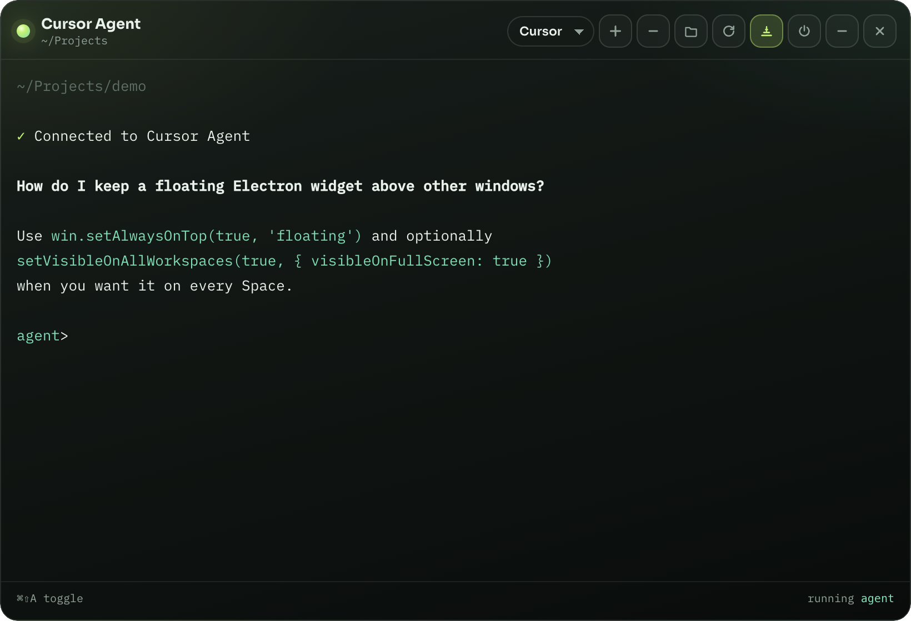

# Agent Widget

Floating macOS desktop widget for AI agent CLIs — a collapsed pill that expands into a real terminal running Cursor’s `agent`, Claude Code, or any custom command.

<p align="center">
  
</p>

<p align="center">
  
</p>

## Features

- **Tabs** — open multiple sessions per agent; tabs persist across restarts until you close them
- **Pill → panel** — collapsed capsule; click to expand a full PTY terminal
- **Real agents** — Cursor (`agent`), Claude (`claude`), plus custom commands
- **Always on top** — optional floating mode with click-through around the pill
- **Open at login** — toggle in the panel or during install
- **Workspace picker** — choose the cwd the agent runs in
- **Global toggle** — `⌘⇧A` while the app is running
- **Tray menu** — show, always-on-top, open at login, quit
- **Menu bar app** — no Dock icon (`LSUIElement`)

## Requirements

- macOS 13+
- Node.js 18+
- An agent CLI on your `PATH` (`agent` / `cursor-agent` and/or `claude`)

## Install

```bash
git clone https://github.com/mowhammadrezaa/agent-widget.git agent-widget
cd agent-widget
./install              # choose Auto or Custom
./install --auto       # defaults, no questions
./install --custom     # ask every preference
```

**Auto** installs deps if needed, uses sensible defaults (workspace, Cursor agent, always on top, open at login), creates `~/Applications/Agent Widget.app`, and launches.

**Custom** asks each preference interactively.

## Usage

| Action | How |
| --- | --- |
| Open | Click the pill, tray **Show Agent**, or `open -a "Agent Widget"` |
| Move | Drag the pill |
| Collapse | Move the pointer away, press `Esc`, or the − control |
| Quit | ✕ on the pill/panel, or tray **Quit** |
| Toggle | `⌘⇧A` (while running) |
| Switch agent | Dropdown opens that agent in a **new** tab (current tab stays) |
| New tab | ＋ on the tab bar (uses the selected agent) |
| Close tab | × on a tab, or **Close all** |
| Add agent | ＋ next to the agent dropdown, then enter a command (e.g. `codex`) |

## Configuration

Stored at `~/.agent-widget.json`:

| Key | Meaning |
| --- | --- |
| `workspace` | Agent working directory |
| `agentId` | Active agent (`cursor`, `claude`, or custom id) |
| `tabs` | Open sessions `{ id, agentId }` — restored across restarts |
| `activeTabId` | Selected tab |

Tab scrollback is stored separately at `~/.agent-widget-buffers.json` so sessions survive quit/relaunch (the live PTY still starts fresh).
| `alwaysOnTop` | Float above other windows |
| `customAgents` | User-defined `{ id, label, command }` entries |

Login item: `~/Library/LaunchAgents/com.agent-widget.plist`  
App shortcut: `~/Applications/Agent Widget.app`

## Scripts

| Command | Description |
| --- | --- |
| `./install` | Pick Auto or Custom install |
| `./install --auto` | Silent install with defaults |
| `./install --custom` | Ask every install preference |
| `./uninstall` | Pick Auto or Custom uninstall |
| `./uninstall --auto` | Remove app, login, config, logs |
| `./uninstall --custom` | Ask what to remove |
| `npm start` | Run from the repo |
| `npm run rebuild` | Rebuild `node-pty` for Electron |
| `npm run screenshots` | Refresh README screenshots |

## Uninstall

```bash
./uninstall            # choose Auto or Custom
./uninstall --auto     # remove app, login, config, logs
./uninstall --custom   # pick what to remove
```

The git repo is never deleted automatically.

## Development

```bash
npm install
npm start
```

Main process: `electron/main.cjs` · Preload: `electron/preload.cjs` · UI: `src/`

## Troubleshooting

| Issue | Fix |
| --- | --- |
| Electron won’t start from Cursor’s terminal | Use `./install`, `npm start`, or `open -a "Agent Widget"` (clears `ELECTRON_RUN_AS_NODE`) |
| Agent not found | Install the CLI, ensure it’s on `PATH`, then hit Restart |
| Pill not clickable | Turn **always on top** on, or click the tray icon |
| Native module errors | `npm run rebuild` |

## License

[MIT](LICENSE) — free to use, modify, sell, and redistribute, as long as you keep the copyright notice and clearly indicate the original source repository.
